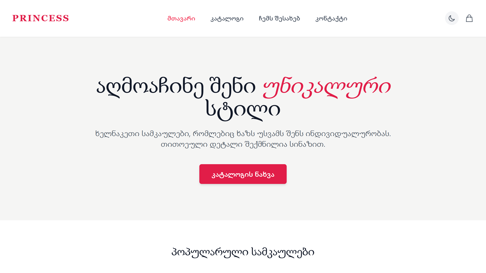
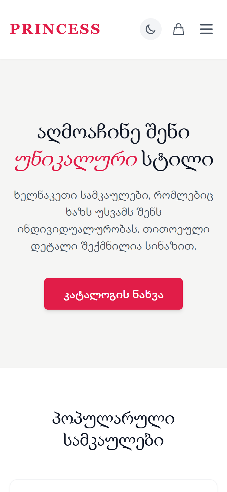
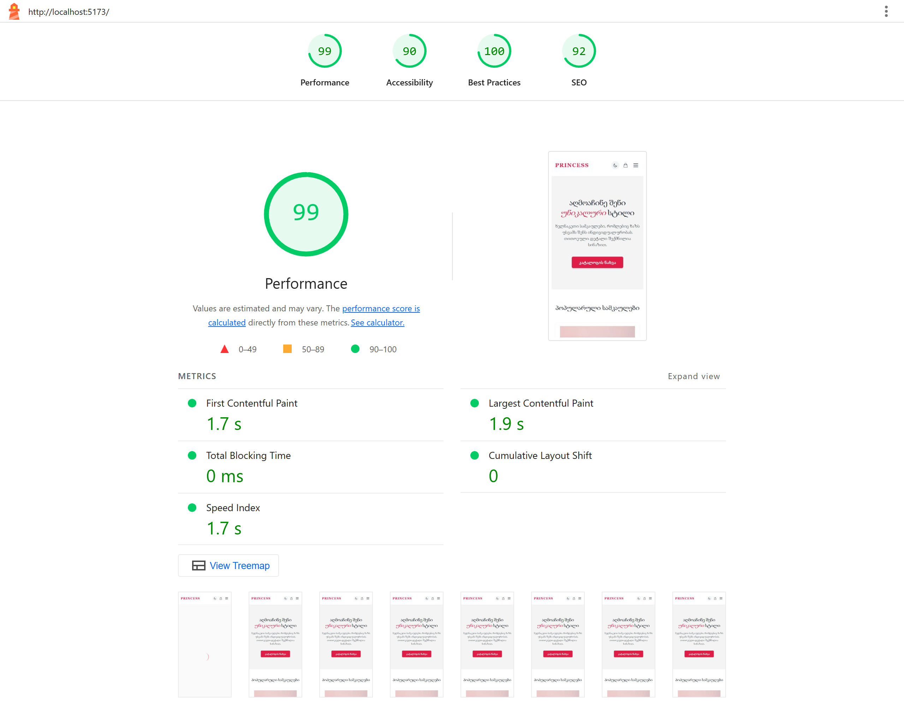

# mariam-iobidze-catalogi

> Online კატალოგის ვებ-საიტი, სადაც მომხმარებელს შეუძლია ნივთების დათვალიერება, ყიდვა, პროდუქტების გაფილტვრა და შეკვეთის გაფორმება.

06.04- პროექტის თემის შერჩევა
06.04- გვერდების სქემის შედგენა
06.04- GitHubრეპოზიტორის შექმნა
07.04- სამუშაო გეგმის შედგება
07.04- Vite პროექტის შედგენა
07.04-Tailwind CSS-ის დაყენება
07.04-React Router-ის დაყენება
07.04-საქაღალდეების სტრუქტურა
07.04-პირველი კომიტი
08.04-
08.04-მონაცემების ფალი
---

## 🛠️ ტექნოლოგიები

- ⚛️ React 18 + TypeScript
- 🎨 Tailwind CSS
- 🔀 React Router v6
- 🔗 [API სახელი] — [API ლინკი]
- 🤖 AI ხელსაწყო: [ChatGPT / Claude / Gemini]
- 🐙 Git / GitHub

---

## 📄 გვერდები

| გვერდი | მარშრუტი | აღწერა |
|--------|----------|--------|
| მთავარი | `/` | [აღწერა] |
| [გვერდი 2] | `/[path]` | [აღწერა] |
| [გვერდი 3] | `/[path]` | [აღწერა] |
| კონტაქტი | `/contact` | [აღწერა] |

---

## 🚀 ინსტალაცია

```bash
git clone https://github.com/iobidzemari13-dot/mariam-iobidze-catalogi.git]
cd [mariam-iobidze-catalogi]
npm install
npm run dev
```

---

## 🖥️ სკრინშოტები

### Desktop


### Mobile


---

## 🤖 AI გამოყენება

[აღწერე სად და როგორ გამოიყენე AI. მაგ: "Claude-ს გამოვიყენე Header კომპონენტის TypeScript Props-ის სტრუქტურის შესამოწმებლად. AI-ს პასუხი სწორი იყო, მაგრამ Tailwind კლასები ხელით შევცვალე."]

---

## ⚡ Lighthouse ქულა



| Performance | Accessibility | Best Practices | SEO |
|-------------|---------------|----------------|-----|
| [ქულა] | [ქულა] | [ქულა] | [ქულა] |

---

## 👤 ავტორი

**[მარიამ იობიძე]** — [https://github.com/iobidzemari13-dot]
