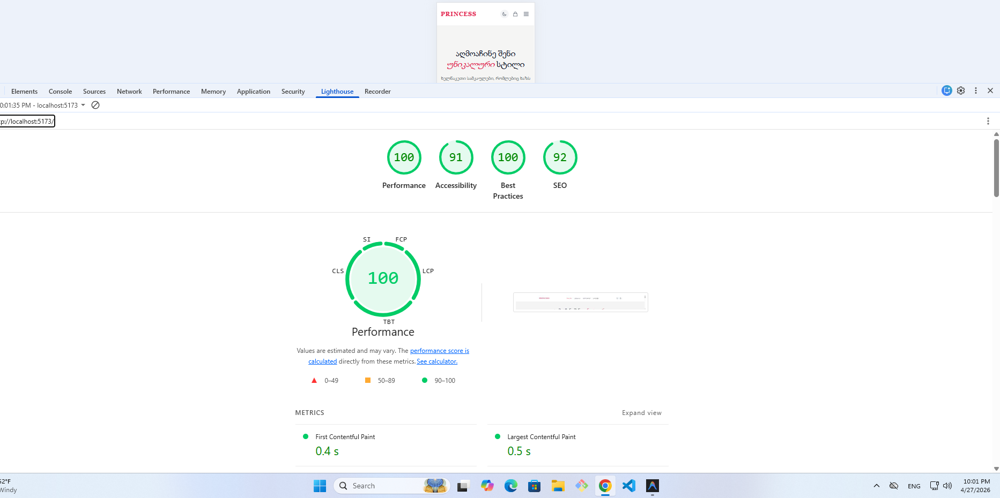

# mariam-iobidze-catalogi

> Online კატალოგის ვებ-საიტი, სადაც მომხმარებელს შეუძლია ნივთების დათვალიერება, ყიდვა, პროდუქტების გაფილტვრა და შეკვეთის გაფორმება.

- **06.04** - პროექტის თემის შერჩევა
- **06.04** - გვერდების სქემის შედგენა
- **06.04** - GitHub რეპოზიტორის შექმნა
- **07.04** - სამუშაო გეგმის შედგენა
- **07.04** - Vite პროექტის შექმნა
- **07.04** - Tailwind CSS-ის დაყენება
- **07.04** - React Router-ის დაყენება
- **07.04** - საქაღალდეების სტრუქტურის შექმნა
- **07.04** - პირველი კომიტი
- **08.04** - Redux ინტეგრაცია
- **08.04** - ლოკალური მონაცემების ბაზა (Mock Data)
---

## 🛠️ ტექნოლოგიები

- ⚛️ **React 18** + **TypeScript**
- 🎨 **Tailwind CSS**
- 🔀 **React Router v6**
- 📦 **Redux Toolkit** (State Management)
- 🗄️ **Local Data** (Mock Products)
- 🤖 **AI ხელსაწყო**: Gemini

- 🐙 Git / GitHub

---

## 📄 გვერდები

| გვერდი | მარშრუტი | აღწერა |
|--------|----------|--------|
| მთავარი | `/` | საიტის მთავარი გვერდი, ზოგადი ინფორმაციით. |
| კატალოგი | `/catalog` | პროდუქტების ჩამონათვალი კატეგორიების ფილტრით. |
| ჩემს შესახებ | `/about` | ინფორმაცია ბრენდზე ან ავტორზე. |
| კალათა | `/cart` | დამატებული პროდუქტების სია (Redux). |
| კონტაქტი | `/contact` | საკონტაქტო ფორმა კითხვების გასაგზავნად. |

---

## 🚀 ინსტალაცია

```bash
git clone https://github.com/iobidzemari13-dot/mariam-iobidze-catalogi.git
cd mariam-iobidze-catalogi
npm install
npm run dev
```

---

## 🖥️ სკრინშოტები

### Desktop


### Mobile


---

## 🤖 AI გამოყენება

პროექტის მიმდინარეობისას გამოყენებული იქნა AI (Gemini):
- React კომპონენტების ტიპიზაციის (TypeScript) სტრუქტურის დასახვეწად და ოპტიმიზაციისთვის.
- Tailwind CSS კლასების შესარჩევად და UI-ს გასაუმჯობესებლად.
- ლოკალური მონაცემების სტრუქტურირებისა და შეცდომების (მაგ. TypeScript Build errors) დიაგნოსტიკისთვის და ბაგების აღმოსაფხვრელად.


---

## ⚡ Lighthouse ქულა


---

## 👤 ავტორი

**მარიამ იობიძე** — [https://github.com/iobidzemari13-dot]

#AI Screenshots
1. 
